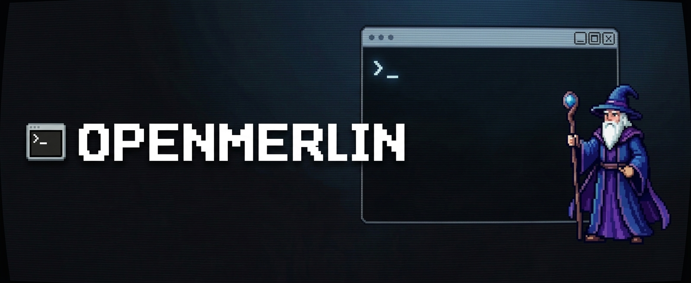

# 

<div align="center">

[](https://www.npmjs.com/package/openmerlin)
[](LICENSE)
[](CONTRIBUTING.md)
[](https://www.typescriptlang.org/)
[](https://nodejs.org/)

### **Production CLI coding agent — connects to any AI.**

*Lightweight. Fast. Built for engineers who live in the terminal.*

</div>

---

## Why OpenMerlin?

Most AI coding tools are bloated GUI apps that lock you into one provider, burn through tokens, and yank you out of your flow. OpenMerlin stays in your terminal, connects to **any LLM**, and keeps API costs low with smart token management built in from day one. When it's time to review a change, it opens a clean side-by-side diff right in VS Code — no noise, no context switching, no surprises.

---

## Demo


> *OpenMerlin planning a refactor, writing diffs, and opening a VS Code review — all from the terminal.*

---

## ✨ Features

- 🧠 **Two-Phase Agentic Loop** — Clean separation between the Plan Phase (AI reasoning + diff generation) and the Apply Phase (code execution with your explicit confirmation).
- 🔀 **Multi-Agent Mode** — Spin up parallel worker agents for large tasks with `--multi`.
- 🔌 **Universal AI Compatibility** — OpenAI, Anthropic, Google Gemini, Groq, OpenRouter, and Ollama (local). Switch providers at runtime.
- 🖥️ **VS Code Diff Integration** — Every file change opens as a side-by-side diff in your IDE. Review it like a pull request before anything touches disk.
- 🛡️ **Safety-First Tool System** — File writes and shell commands always require explicit confirmation. Dangerous patterns are blocked before execution.
- 💸 **Advanced Token Management** — Sliding-window pruning, conversation compaction, and tool output truncation keep long sessions fast and cheap.
- ⚡ **Lightweight by Design** — Pure TypeScript on Node.js. No heavy runtimes, no Electron, no bloat.

---

## 🚀 Quickstart

**Install globally:**

```bash
npm install -g openmerlin
```

**Or run instantly with npx:**

```bash
npx openmerlin
```

**Start a session in your project:**

```bash
cd path/to/your/project
openmerlin
```

---

## 🛠️ Configuration

On first run, OpenMerlin launches an interactive setup to create your provider/model profiles.

**Supported providers out of the box:**

| Provider | Type |
|---|---|
| OpenAI | Cloud |
| Anthropic | Cloud |
| Google Gemini | Cloud |
| Groq | Cloud |
| OpenRouter | Cloud |
| Ollama | Local |

Config is saved automatically to:

- **macOS / Linux:** `~/.myagent/config.json`
- **Windows:** `%USERPROFILE%\.myagent\config.json`

Multiple profiles are supported. Switch between them at runtime with `--model`. Existing single-profile configs are migrated automatically on load.

---

## 🧠 How It Works

### Two-Phase Agentic Loop

OpenMerlin separates *thinking* from *doing* — a distinction most agents skip.

**Plan Phase** — The AI scans your project structure, `package.json`, and `README.md` for context, reasons about the task, and generates a structured set of diffs. Nothing is written to disk yet.

**Apply Phase** — You review the proposed changes (side-by-side in VS Code or inline in the terminal), confirm, and OpenMerlin executes. Every write and shell command requires your explicit approval.

### Token Management

Long coding sessions are expensive. OpenMerlin handles this automatically with:

- **Sliding-window pruning** — older low-value messages are dropped from context
- **Conversation compaction** — summaries replace verbose history without losing meaning
- **Tool output truncation** — large file reads and command outputs are trimmed before hitting the context window

### Safety Model

- All file access is restricted to paths inside your active project root
- `write_file` always shows a diff and asks for confirmation before writing
- `run_command` always asks for confirmation and blocks dangerous patterns
- Shell execution has a 30-second timeout and a 1 MB output buffer

---

## 📁 Architecture

```text
src/
  index.ts         # CLI bootstrap and prompt loop
  config.ts        # Profile setup, save/load, switching
  scanner.ts       # Project structure + metadata summarization
  agent.ts         # Main LLM loop and tool-call execution
  llm.ts           # OpenAI-compatible HTTP client
  planner.ts       # Plan generation and user approval
  safety.ts        # Path safety and dangerous command rules
  output.ts        # Terminal UI and formatting
  tools/
    index.ts       # Tool registration and dispatch
    listFiles.ts
    readFile.ts
    runCommand.ts
    searchCode.ts
    writeFile.ts
```

---

## 💬 Commands

| Command | Description |
|---|---|
| `--model` / `switch` | Switch provider or model profile |
| `--config` | Open runtime configuration menu |
| `--clear` | Clear conversation history |
| `--multi <task>` | Run task with parallel worker agents |
| `--help` | Show all commands |
| `--exit` / `quit` | Exit OpenMerlin |

**Example prompts to get started:**

```
find all TODOs in src
add error handling to functions in src/api.ts
explain how auth works in this repo
run tests and summarize failures
```

---

## 🤝 Contributing

OpenMerlin is open source and PRs are very welcome.

```bash
git clone https://github.com/your-username/openmerlin-cli
cd openmerlin-cli
npm install
npm run dev
```

Validate your changes with `npm run build`, then test manually with `npm run dev` in a sample project. Open a PR describing your changes, reasoning, and how you tested it.

**Good first issues:**

- Add `LICENSE` file in root
- Add `CONTRIBUTING.md`
- Add tests for dangerous command pattern coverage
- Improve command help output with better examples
- Add docs for profile migration behavior

See [CONTRIBUTING.md](CONTRIBUTING.md) for the full guide.

---

## 📄 License

MIT — see [LICENSE](LICENSE) for details.

---

<div align="center">

Built with TypeScript · Made for developers who ship

**[npm](https://www.npmjs.com/package/openmerlin) · [Issues](https://github.com/your-username/openmerlin-cli/issues) · [Discussions](https://github.com/your-username/openmerlin-cli/discussions)**

</div>